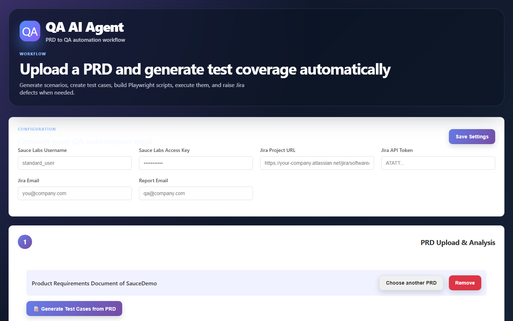
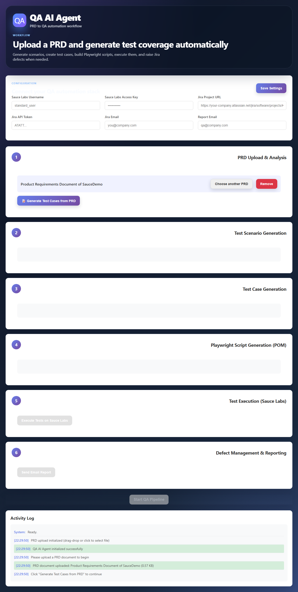

# QA AI Agent - Intelligent Test Automation Platform

## Project Title
**QA AI Agent - End-to-End Intelligent QA Automation Platform**

## Problem Statement
Manual test case generation, automation scripting, and test execution management are time-consuming and error-prone processes. QA teams struggle with:
- Converting PRD documents into comprehensive test cases
- Maintaining test automation scripts across application changes
- Coordinating test execution across cloud platforms
- Tracking and managing defects discovered during testing
- Generating consistent, actionable reports for stakeholders

## Solution
The QA AI Agent is an intelligent, end-to-end QA automation platform that bridges the gap between product requirements and automated testing. It leverages AI to:
- Parse PRD documents and generate comprehensive test scenarios
- Automatically create production-ready Playwright automation scripts
- Execute tests on cloud platforms (Sauce Labs)
- Automatically create Jira tickets for discovered defects
- Generate and send detailed email reports to stakeholders

### Key Features
- **AI-Powered Test Generation**: Automatically generates positive, negative, and edge case test scenarios from PRD documents
- **POM-Based Automation**: Creates maintainable Playwright scripts using Page Object Model architecture
- **Cloud Execution**: Runs tests on Sauce Labs for scalability and cross-browser testing
- **Defect Management**: Auto-creates Jira tickets with logs, screenshots, and steps to reproduce
- **Smart Reporting**: Sends comprehensive email reports with execution metrics and defect details

## Tech Stack

### Frontend
- **HTML5**: Structure and markup
- **CSS3**: Modern styling with responsive design
- **JavaScript (ES6+)**: Interactive functionality and UI logic
- **File API**: PRD document upload and parsing

### Backend Integration
- **Playwright**: Browser automation framework
- **Page Object Model (POM)**: Design pattern for test organization
- **Sauce Labs**: Cloud-based test execution platform
- **Jira API**: Defect tracking and management
- **Email Service**: Automated reporting (SMTP/Nodemailer)

### AI/Processing
- **Document Parsing**: PDF, Word, Markdown PRD analysis
- **Test Case Generation**: AI-driven scenario creation
- **Script Generation**: Automated Playwright code generation

## Architecture

```
┌─────────────────────────────────────────────────────────┐
│                    QA AI Agent Platform                  │
└─────────────────────────────────────────────────────────┘
                          │
          ┌───────────────┼───────────────┐
          │               │               │
    ┌─────▼─────┐   ┌────▼─────┐   ┌────▼─────┐
    │   Step 1  │   │  Step 2  │   │  Step 3  │
    │Ingestion  │──▶│   Test   │──▶│  Script  │
    │ & Analysis│   │   Case   │   │ Generation│
    └───────────┘   │ Generation│   └──────────┘
                    └───────────┘
                          │
                    ┌─────▼─────┐
                    │  Step 4   │
                    │ Execution │
                    │(SauceLabs)│
                    └─────┬─────┘
                          │
              ┌───────────┴───────────┐
              │                       │
        ┌─────▼─────┐           ┌─────▼─────┐
        │  Step 5   │           │  Step 6   │
        │  Defect   │           │ Reporting │
        │  Triage   │           │  (Email)  │
        │  (Jira)   │           └───────────┘
        └───────────┘
```

### Workflow

1. **PRD Upload & Analysis**: User uploads PRD document → AI agent parses and analyzes requirements
2. **Test Scenario Generation**: AI generates comprehensive test scenarios covering positive, negative, and edge cases
3. **Test Case Generation**: Detailed test cases are created and exported as PDF/Word documents
4. **Automation Script Generation**: Playwright scripts are generated using POM architecture
5. **Test Execution**: Scripts execute on Sauce Labs cloud platform
6. **Defect Management**: Failed tests automatically create Jira tickets with full context
7. **Reporting**: Comprehensive email report sent with execution metrics

## How to Run

### Prerequisites
- Modern web browser (Chrome, Firefox, Edge, Safari)
- Node.js (v14+) for backend services (optional)
- API credentials for Sauce Labs, Jira, and Email service

### Running the Frontend

1. **Clone or Download the Project**
   ```bash
   git clone <repository-url>
   cd QA_AI_Solution
   ```

2. **Open in Browser**
   - Simply open `index.html` in your web browser
   - Or use a local server:
     ```bash
     # Using Python
     python -m http.server 8000
     
     # Using Node.js
     npx http-server
     
     # Using VS Code Live Server extension
     # Right-click index.html → "Open with Live Server"
     ```

3. **Access the Application**
   - Navigate to `http://localhost:8000` (if using a server)
   - Or open `index.html` directly in your browser

### Configuration

1. **Configure API Credentials**
   - Navigate to the Configuration section
   - Enter Sauce Labs credentials
   - Enter Jira API token and project details
   - Set target email address for reports

2. **Upload PRD Document**
   - Click "Upload PRD" button
   - Select your PRD file (PDF, Word, or Markdown)
   - Click "Analyze & Generate Tests"

3. **Monitor Progress**
   - Watch the AI agent workflow in real-time
   - View generated test scenarios and cases
   - Review generated Playwright scripts
   - Monitor test execution progress

4. **Review Results**
   - View test execution results
   - Check Jira tickets created for defects
   - Receive comprehensive email report

## Demo (Vercel)

**Live application:** [https://qa-ai-solution.vercel.app](https://qa-ai-solution.vercel.app)

The frontend is deployed on Vercel and connects to the Render backend for Playwright test execution.

## Screenshots and Supporting Documents

The live application demonstrates the complete workflow:

1. PRD upload and analysis
2. Test scenario and test case generation
3. Playwright script generation
4. Live execution progress for all generated test cases
5. Jira defect creation and email report preparation

Open the [live Vercel demo](https://qa-ai-solution.vercel.app) to view the current application.

### Live Application Screenshots

#### Dashboard



#### Full Workflow Page



The screenshots above were captured directly from the deployed Vercel application and are stored in `docs/screenshots/`.

## Project Structure

```
QA_AI_Solution/
├── index.html              # Main HTML page
├── styles.css              # Styling
├── app.js                  # Main application logic
├── prompt.md               # RICEPOT Framework Specification
├── README.md               # Project documentation
├── screenshots/            # Application screenshots
│   ├── dashboard.png
│   ├── prd-upload.png
│   ├── test-scenarios.png
│   ├── scripts.png
│   ├── execution.png
│   ├── defects.png
│   └── email-report.png
├── modules/
│   ├── prd-analyzer.js     # PRD document parsing
│   ├── test-generator.js   # Test scenario/case generation
│   ├── script-generator.js # Playwright script generation
│   ├── executor.js         # Test execution controller
│   ├── jira-integration.js # Jira API integration
│   └── email-service.js    # Email reporting service
└── assets/
    ├── icons/              # UI icons
    └── templates/          # Report templates
```

## Features in Detail

### 1. PRD Document Upload & Analysis
- Supports multiple formats: PDF, Word (.docx), Markdown
- Intelligent parsing of functional requirements
- Extraction of user stories and acceptance criteria
- Identification of testable features

### 2. Test Scenario Generation
- Positive test scenarios (happy path)
- Negative test scenarios (error handling)
- Edge case scenarios (boundary values)
- Cross-browser compatibility tests
- Performance test suggestions

### 3. Test Case Generation
- Detailed step-by-step test cases
- Expected results for each step
- Priority and severity assignment
- Export to PDF/Word format
- Traceability matrix linking to PRD requirements

### 4. Playwright Script Generation
- Production-ready automation scripts
- Page Object Model (POM) architecture
- Best practices implementation
- Environment configuration handling
- Retry mechanisms and error handling

### 5. Cloud Execution
- Integration with Sauce Labs
- Parallel test execution
- Cross-browser testing capability
- Real-time execution monitoring
- Video and screenshot capture

### 6. Defect Management
- Automatic Jira ticket creation
- Comprehensive defect information:
  - Error logs and stack traces
  - Screenshots of failures
  - Steps to reproduce
  - Environment details
  - Test case reference
- Status tracking and updates

### 7. Email Reporting
- Comprehensive HTML email reports
- Key metrics:
  - Total test cases executed
  - Pass/fail counts
  - Pass percentage
  - Execution time
  - Defects raised
  - Environment details
- Jira defect links included
- Attachments available

## Browser Compatibility
- Chrome (latest)
- Firefox (latest)
- Safari (latest)
- Edge (latest)

## Future Enhancements
- Integration with additional test frameworks (Cypress, Selenium)
- Support for API testing
- AI-powered test optimization
- Advanced analytics and trending
- Integration with CI/CD pipelines
- Support for mobile app testing
- Natural language test case input

## Contributing
Contributions are welcome! Please follow these steps:
1. Fork the repository
2. Create a feature branch
3. Commit your changes
4. Push to the branch
5. Create a Pull Request

## License
This project is licensed under the MIT License.

## Support
For issues, questions, or contributions, please open an issue in the repository.

---

**Built with ❤️ for the QA Community**
